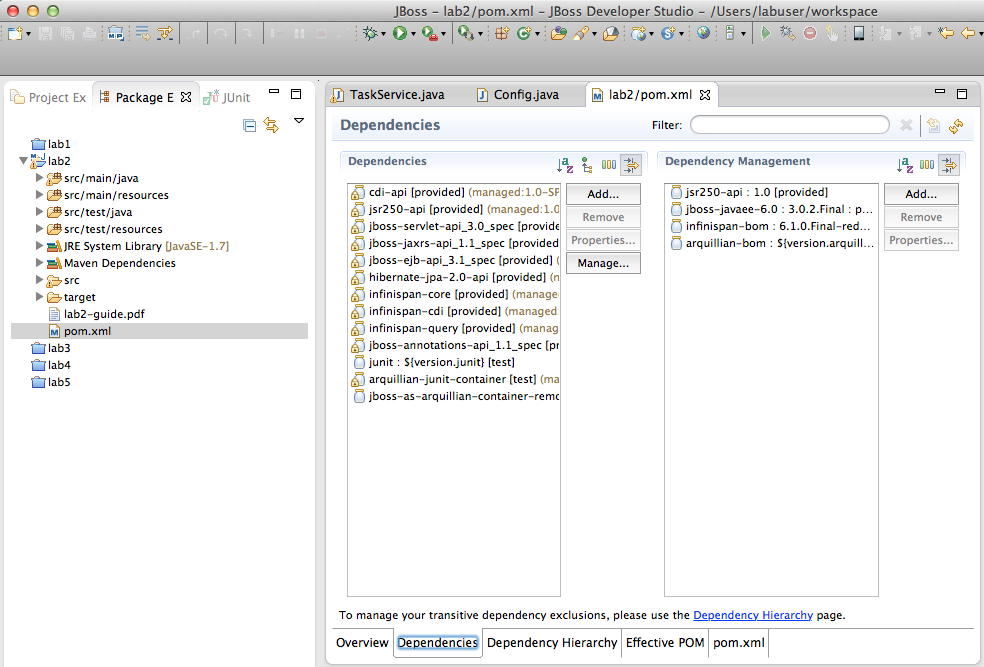
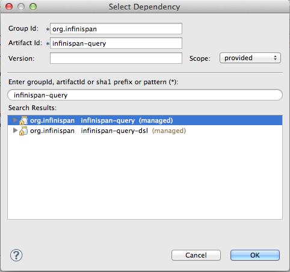
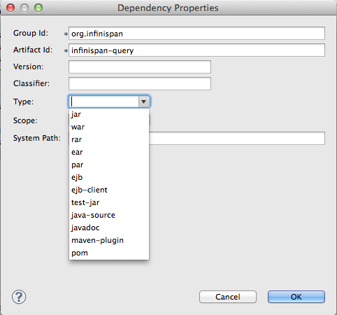

# JDG + EAP Lab Guide 2
This explains the steps for lab 2, either follow them step-by-step or if you feel adventurous read the overview and try to accomplish goals without the help of the step-by-step

## Overview of Lab 1
In this lab we will add a filter that via ajax automatically filter tasks based on a search string. In the initial project setup the UI and a filter method that uses DB queries are used implemented. You task is to replace the DB Query with a JDG Query and you will have to do this without modifying the org.jboss.infinspan.demo.model.Task class. 

To to this we need to do the following:

1. Update the pom.xml and add developer dependency to infinispan-query
2. Update jboss-deployment-structure.xml to add runtime dependency to infinispan-query
3. Enable indexing in the API Configuration. Hint [See the Infinispan Query Index](http://red.ht/1nSniBo)
  - The index should only be persisted in RAM
  - Since we will later deploy this on mulitple EAP instances we need to allow for shared indexes.
  - The index should be based on the `title` field from `org.jboss.infinspan.demo.model.Task`
4. Replace the implementation of `TaskSerivce.filter(String)` to query JDG instead of DB

## Step-by-Step

### Add developer dependencies

1. Open pom.xml
2. Select the dependencies tab

  
  
3. Click **Add...** button
4. Type `infinispan-query` in the search field and select the managed version that should appear.

  
  
5. Change **Scope** to `provided` and Click **OK**
6. Select the newly added dependency and click **Properties...**
7. Remove the Type by deleting boundle.
  
  
